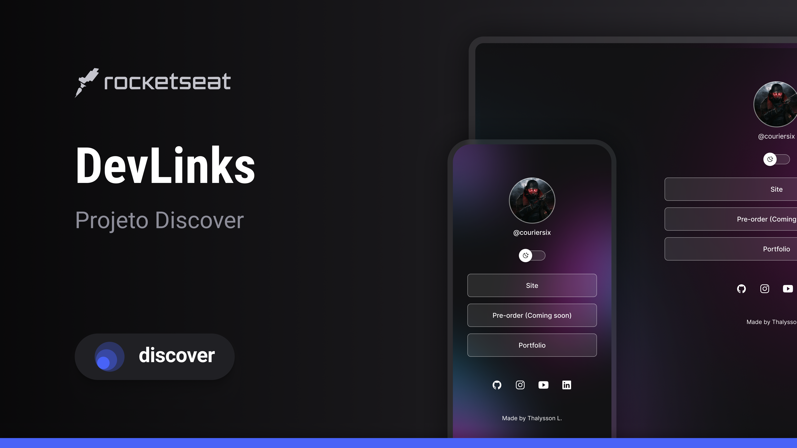

<h1 align="center"> Projeto Front-end - DevLinks </h1>

Projeto desenvolvido como parte do programa exclusivo e gratuito, promovido pela Rocketseat para ensino de tecnologias WEB.  

  <a href="#-tecnologias">Tecnologias</a>&nbsp;&nbsp;&nbsp;|&nbsp;&nbsp;&nbsp;
  <a href="#-projeto">Projeto</a>&nbsp;&nbsp;&nbsp;|&nbsp;&nbsp;&nbsp;
  <a href="#-layout">Layout</a>&nbsp;&nbsp;&nbsp;&nbsp;&nbsp;&nbsp;

 

  

## 🚀 Tecnologias

Esse projeto foi desenvolvido com as seguintes tecnologias:

- HTML e CSS
- JavaScript
- Git e Github
- Figma

## 💻 Projeto

O DevLinks é um agregador de links para usar como cartão de visitas online. O que foi desenvolvido no curso, complementa um outro projeto de UI feito por mim.

- [Projeto DevLinks](https://github.com/lynx144-ux/Projeto-Front-End.io)

- [Projeto de UI - Fallout: New Vegas Remastered](https://www.figma.com/proto/gMKWVFiMNGXIz0DtogFhcX/PROJETO-TESTE?node-id=65-29&t=xOqnPcVaEGL0q5Sk-1&scaling=contain&content-scaling=fixed)

## 🔖 Layout

Você pode visualizar o layout de referência do projeto do curso através [DESSE LINK](https://www.figma.com/community/file/1187422022288947321). É necessário ter conta no [Figma](https://figma.com) para acessá-lo.
Este layout foi utilizado como base, mas foi adaptado por mim para ser uma extensão de um projeto anterior.

Feito por Thalysson L. :wave: [Conheça meus outros projetos de UX/UI](https://thalysson-lopes.notion.site/bbc27695c46940c68b37d6ba6f6f1947?v=435ce854924546bbb10fb331f42018ce)
